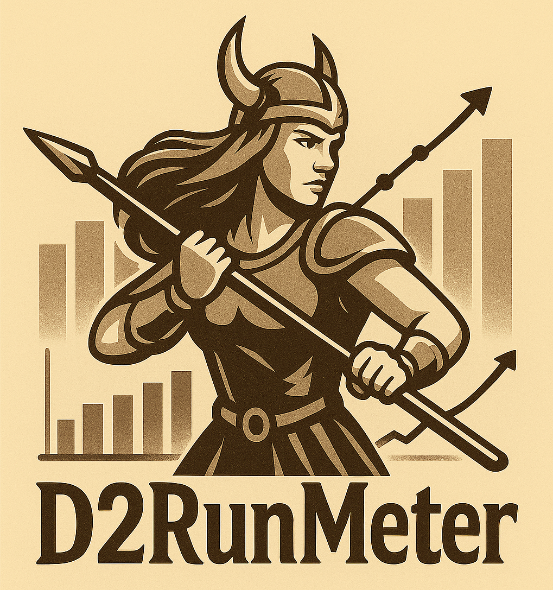

<p align="center">
  
</p>

# D2RunMeter

A real-time statistics tracker for Diablo 2 characters. Monitors experience, gold, runs, and provides level-up estimates by parsing save game files.

## Screenshots


## Requirements

- .NET 8.0
- Diablo 2 save files (.d2s)

## Building

```bash
dotnet build D2.UI/D2.UI.csproj
```

## Running

```bash
dotnet run --project D2.UI/D2.UI.csproj
```

## License

MIT License - see [LICENSE](LICENSE) file for details.

## Author

Created by [Xylol](https://github.com/Xylol)
